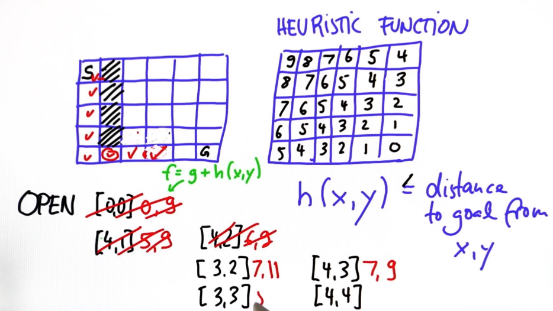
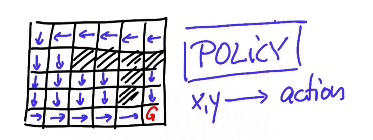

# # Expansion.

Given the following:

- Map 
- Starting Location 
- Goal Location 
- Cost of movement

_Find the minimum cost path._

The least efficient algorithm to calculate the minimum cost path is to expand each adjacent node from the starting node until all of the nodes are traversed. By doing so, the costs will increase after each unexplored cell gets traversed. In the end, the minimum cost path with be traversable. 

```python
grid = [[0, 0, 0, 0, 0, 0],
        [0, 1, 1, 1, 1, 0],
        [0, 1, 0, 0, 0, 0],
        [0, 1, 0, 0, 0, 0],
        [0, 1, 0, 0, 1, 0,]]
init = [0, 0]
goal = [len(grid)-1, len(grid[0])-1]
cost = 1

delta = [[-1, 0], # go up
         [ 0,-1], # go left
         [ 1, 0], # go down
         [ 0, 1]] # go right

def search(grid,init,goal,cost):

    # Closed consists of nodes that are expanded, so we do not expand them again
    expand = [[-1 for col in range(len(grid[0]))] for row in range(len(grid))]    
    closed = [[0 for row in range(len(grid[0]))] for col in range(len(grid))]
    closed[init[0]][init[1]] = 1
    open = [[0, init[0], init[1]]]
    found = False # Goal Position
    resign = False # No more expansions possible

    while (not found and not resign):

        if len(open) == 0:
            resign = True
            print("Failed!")
            continue

        # We want to analyze the smallest g value from the list
        open.sort()
        open.reverse()
        next = open.pop()

        x = next[1]
        y = next[2]
        g = next[0]

        if [x,y] == goal:
            found = True
            print(next)
            continue

        for i in range(len(delta)):
            x2 = x + delta[i][0]
            y2 = y + delta[i][1]
            if x2 >= 0 and x2 < len(grid) and y2 >= 0 and y2 < len(grid[0]):
                if closed[x2][y2] == 0 and grid[x2][y2] == 0:
                    g2 = g + cost
                    open.append([g2,x2,y2])
                    closed[x2][y2] = 1

    return closed
```

---

## A*

The A* algorithm works by first calculating a heuristic of the same world grid. 

$$
h(x,y) \le (euclideandistancefrom(x,y))
$$

After the heuristic grid  is calculated, the robot can then begin it's path planning. Continuing on from the expanded algorithm, each cell (starting from the initial cell) has the cost of the adjacent cells calculated and put into the **open** list. However, this time a new cost *f* is used to denote the cost where *f* is the sum of movement cost *g* and the corresponding heuristic value *h*.



```python
grid = [[0, 0, 0, 0, 0, 0],
        [0, 1, 1, 1, 1, 0],
        [0, 1, 0, 0, 0, 0],
        [0, 1, 0, 0, 0, 0],
        [0, 1, 0, 0, 1, 0,]]
heuristic = [[9, 8, 7, 6, 5, 4],
             [8, 7, 6, 5, 4, 3],
             [7, 6, 5, 4, 3, 2],
             [6, 5, 4, 3, 2, 1],
             [5, 4, 3, 2, 1, 0]]

init = [0, 0]
goal = [len(grid)-1, len(grid[0])-1]
cost = 1

delta = [[-1, 0 ], # go up
         [ 0, -1], # go left
         [ 1, 0 ], # go down
         [ 0, 1 ]] # go right

delta_name = ['^', '<', 'v', '>']

def search(grid,init,goal,cost,heuristic):
 # ----------------------------------------
 # modify the code below
 # ----------------------------------------
closed = [[0 for col in range(len(grid[0]))] for row in range(len(grid))]
closed[init[0]][init[1]] = 1
expand = [[-1 for col in range(len(grid[0]))] for row in range(len(grid))]
action = [[-1 for col in range(len(grid[0]))] for row in range(len(grid))]

x = init[0]
y = init[1]
g = 0
h = heuristic[x][y]
f = g + h

""" g is needed since it is the true cost of the action """
open = [[f, g, x, y]]

found = False  # flag that is set when search is complete
resign = False # flag set if we can't find expand
count = 0

# Resign indicates failure    
while not found and not resign:
    if len(open) == 0:
        resign = True
        return "Fail"
    else:

        # Using the combined cost f is what makes a difference to the search here.
        # Since the list gets sorted by f, the cell with the minimum cost at this point
        # gets prioritized. In the best case, this means that we do not even need to traverse
        # through higher cost cells.
        open.sort()
        open.reverse()
        next = open.pop()

        x = next[2]
        y = next[3]
        g = next[1]

        expand[x][y] = count
        count += 1

        if x == goal[0] and y == goal[1]:
            found = True
        else:
            for i in range(len(delta)):
                x2 = x + delta[i][0]
                y2 = y + delta[i][1]
                if x2 >= 0 and x2 < len(grid) and y2 >=0 and y2 < len(grid[0]):
                    if closed[x2][y2] == 0 and grid[x2][y2] == 0:
                        g2 = g + cost
                        h2 = heuristic[x2][y2]
                        f2 = g2 + h2
                        open.append([f2, g2, x2, y2])
                        closed[x2][y2] = 1

return expand
```

> Note, the major advantage of the A\* algorithm is that in the best case, not all cells get traversed. As long as the heuristic function is calculated correctly, then the minimum cost path will be found without needing to look at each cell. 

---

## Dynamic Programming

This is the most computationally expensive but also most flexible approach to path planning. Rather than focusing on a starting location, each grid cell is given a value equal to the minimum cost needed to reach the goal **from that location.** This function is O(n) complexity but has the benefit of providing a least cost function from <u>any</u> starting location.

In addition to just calculating the cost, you can also create a **policy**, a copy of the grid which defines the optimal movement that the car should take in that cell to reach the goal.




```python
grid = [[0, 1, 0, 0, 0, 0],
        [0, 1, 0, 0, 0, 0],
        [0, 1, 0, 0, 0, 0],
        [0, 1, 0, 0, 0, 0],
        [0, 0, 0, 0, 1, 0]]
init = [0, 0]
goal = [len(grid)-1, len(grid[0])-1]
cost = 1 # the cost associated with moving from a cell to an adjacent one

delta = [[-1, 0 ], # go up
         [ 0, -1], # go left
         [ 1, 0 ], # go down
         [ 0, 1 ]] # go right

delta_name = ['^', '<', 'v', '>']

def optimum_policy(grid,goal,cost):
value = [[99 for i in range(len(grid[0]))] for j in range(len(grid))]
policy = [[' ' for i in range(len(grid[0]))] for j in range(len(grid))]
value[goal[0]][goal[1]] = 0
policy[goal[0]][goal[1]] = '*'

changed = True
while(changed):
    changed = False
    for i in range(len(value)):
        for j in range(len(value[i])):

            # Skip goal pos
            if [i,j] == goal:
                continue

            # Don't update the value for barrier grids
            if grid[i][j] == 1:
                continue

            for d in range(len(delta)):
                x2 = i + delta[d][0]
                y2 = j + delta[d][1]
                # If in bounds
                if x2 >= 0 and x2 < len(grid) and y2 >= 0 and y2 < len(grid[i]):
                    if value[x2][y2] < (value[i][j] - cost):
                        policy[i][j] = delta_name[d]
                        value[i][j] = value[x2][y2] + cost
                        changed = True

return policy
```

---

## Stochastic Motion

In addition to calculating the minimum cost path, we must also account for randomness. **Stochastic motion** refers to the probability that the robot may not successfully perform its intended action. For example, if given a move forward command, assume that it has a 50% chance of performing the action successfully, a 25% chance of mistakenly going left, and a 25% chance of mistakenly going right.

Given these probabilities, we can modify our dynamic programming function to have the minimum cost include these probabilities.

```python
delta = [[-1, 0 ], # go up
         [ 0, -1], # go left
         [ 1, 0 ], # go down
         [ 0, 1 ]] # go right

delta_name = ['^', '<', 'v', '>'] # Use these when creating your policy grid.

# ---------------------------------------------
#  Modify the function stochastic_value below
# ---------------------------------------------

def stochastic_value(grid,goal,cost_step,collision_cost,success_prob):

    value = [[collision_cost for col in range(len(grid[0]))] for row in range(len(grid))]
    policy = [[' ' for col in range(len(grid[0]))] for row in range(len(grid))]

    failure_prob = (1.0 - success_prob)/2.0 # Probability(stepping left) = prob(stepping right) = failure_prob 

    # Initialize the value of the goal
    value[goal[0]][goal[1]] = 0
    policy[goal[0]][goal[1]] = '*'

    # Perform dynamic programming to compute the values for the entire grid
    changed = True
    while(changed):
        changed = False
        for x in range(len(grid)):
            for y in range(len(grid[x])):

                # Skip the goal
                if [x,y] == goal:
                    continue

                # Skip occupied squares
                if grid[x][y] == 1:
                    continue

                # Otherwise, compare the surrounding blocks
                # At each block, the car has for possible directions it can choose to travel 
                for d in range(len(delta)):

                    # Regardless of which direction is taken, there are 3 possible outcomes. Forward Position (success) and 2 alternates
                    forwardPos = [x + delta[d][0], y + delta[d][1]]
                    altPos1 = [x + delta[d-1][0], y + delta[d-1][1]]
                    altPos2 = [(x + delta[(d+1) % len(delta)][0]), (y + delta[(d+1) % len(delta)][1])]

                    # Check the scenario for each of the stochastic operations

                    # If the next position is the goal, it will have the lowest cost (0) so that it is prioritized
                    if forwardPos == goal:
                        forward_cost = 0

                    # If the next position is in bounds, calculate the normal cost
                    elif (forwardPos[0] >= 0 and forwardPos[0] < len(grid)) and (forwardPos[1] >= 0 and forwardPos[1] < len(grid[0])):
                        forward_cost = success_prob * value[forwardPos[0]][forwardPos[1]]

                    # Otherwise, the next position is out of bounds and the cost is calculated from the collision value
                    else:
                        forward_cost = success_prob * collision_cost

                    if altPos1 == goal:
                        alt1_cost = 0
                    elif (altPos1[0] >= 0 and altPos1[0] < len(grid)) and (altPos1[1] >= 0 and altPos1[1] < len(grid[0])):
                        alt1_cost = failure_prob * value[altPos1[0]][altPos1[1]]
                    else:
                        alt1_cost = failure_prob * collision_cost 

                    if altPos2 == goal:
                        alt2_cost = 0
                    elif (altPos2[0] >= 0 and altPos2[0] < len(grid)) and (altPos2[1] >= 0 and altPos2[1] < len(grid[0])):
                        alt2_cost = failure_prob * value[altPos2[0]][altPos2[1]]
                    else:
                        alt2_cost = failure_prob * collision_cost

                    # Sum of all costs
                    total_cost = forward_cost + alt1_cost + alt2_cost + cost_step

                    if total_cost < value[x][y]:
                        value[x][y] = total_cost
                        policy[x][y] = delta_name[d]
                        changed = True

    return value, policy

```