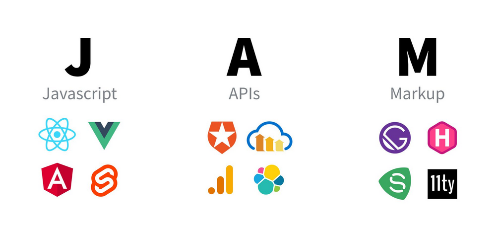
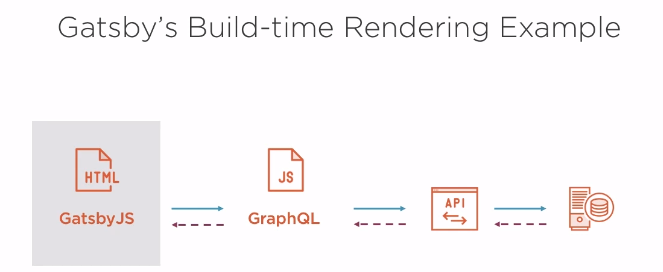

---
title: "Introduction to GatsbyJS"
keywords:
  - React
  - JavaScript
…
 
# JAMStack



- Defn: Modern web development architecture based on client-side JavaScript, reusable APIs, and prebuilt Markup.
- Basically, a website that only uses static content.
- The opposite of server-side rendering; website building happens on the end users machine
- Leads to better performance
- Have a reduced attach surface compared to server-side sites
- Great for #SEO (Search Engine Optimization)

# GatsbyJS
- Built on top of [ReactJS GraphQL WebPack JavaScript]
- Creates static sites using HTML, CSS, JavaScript, and static content (images, markdown)
- 
- Has a full plugin ecosystem.
- Has many starters to choose from which are pre-configured sites that you can build off of: [Gatsby Starters](https://www.gatsbyjs.org/starters)

## Creating a new site in Gatsby:
```bash
gatsby new site-name [starter-template-git-url]
```

### Configuration
- gatsby-browser.js
    - Gatsby settings affecting the browser
- gatsby-config.js
    - Main configuration file for a Gatsby site
- gatsby-node.js
    - Site build process configuration
